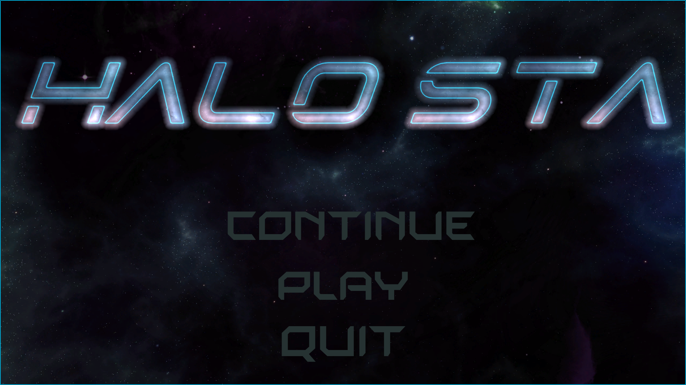
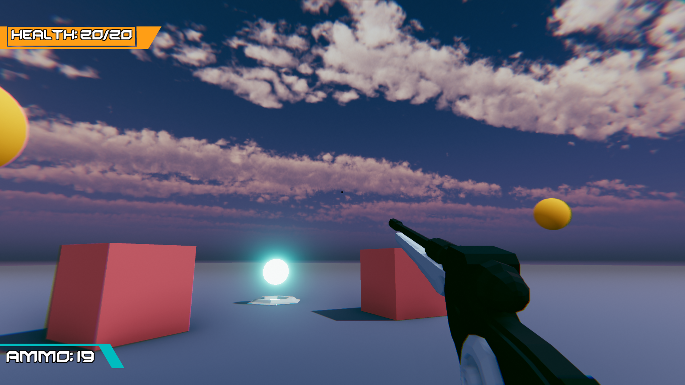
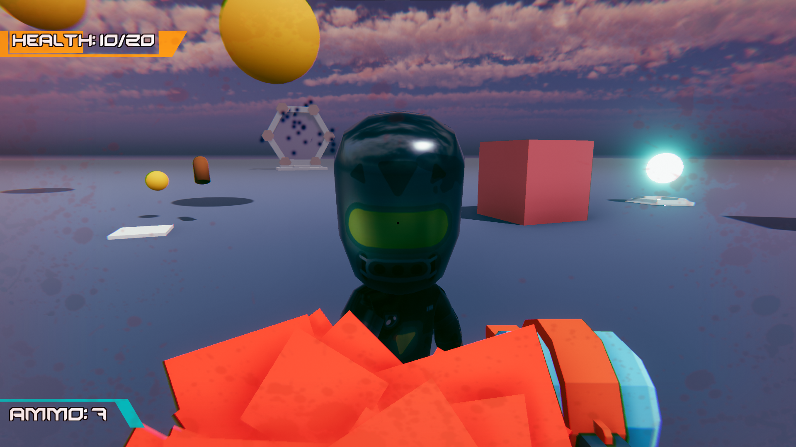
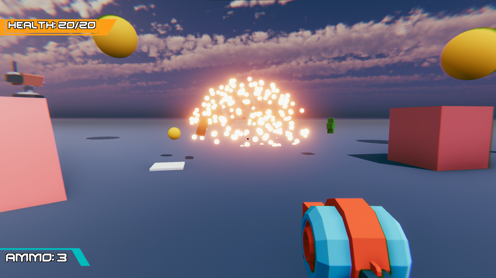
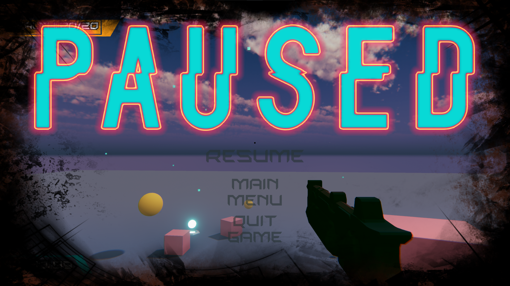
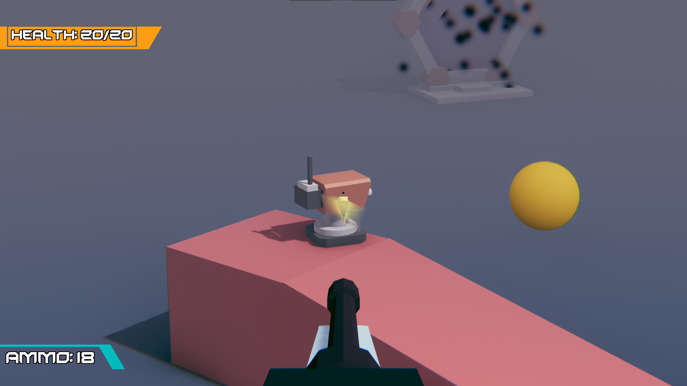

# HALO STA

:tada: :clap: HALO STA, My First Play Shooter Game. :clap: :tada:

| [:sparkles: Getting Started](#getting-started) | [:rocket: Download](#download) | [:camera: Screenshots](#screenshots) |
| --------------- | -------- | ----------- |

<p align="center">
  
</p>

## Getting Started

Follow the below instructions to get started with HALO STA source code:

1. [Make sure you have all Requirements](#requirements)
2. [Download Source Code](#download)
3. Open Project in Unity and Enjoy!

## Requirements

Make sure you have the below requirements before starting:

- [Unity Game Engine](https://unity3d.com)
- Basic Knowledge about Unity and C#

## Download

You can get access to HALO STA source code by using one of the following ways:

- [:fire: Download Source Code](https://github.com/BayatGames/RedRunner/archive/master.zip)
- Clone the repository locally:

```bash
https://github.com/ctmhoang/FPS-Shoot-em-all.git
```

Also you can the build version of the HALO STA from the github page:

- [:star: Download from github](https://github.com/ctmhoang/FPS-Shoot-em-all/releases)

## Screenshots

<p align="center">
  
</p>

<p align="center">
  
</p>

<p align="center">
  
</p>

<p align="center">
  
</p>

<p align="center">
  
</p>

## Credits

- Graphics: 
	* Character and Enviroment : [Kenney](https://kenney.nl/assets?t=character)
	* Guns: [Quaternius](http://quaternius.com/)
	* Skyboxs: Unity Developer Packs
	* [Skybox Dark Nebula](https://assetstore.unity.com/packages/2d/textures-materials/sky/skybox-purple-nebula-2967)
	
- Audio: SoundCloud

- Game Engine: [Unity](https://unity3d.com/)
- Thanks to all of the game development community for their awesome help.

## License

MIT @ [Cameron Hoang](https://github.com/ctmhoang)

Made with :heart: by [Cameron Hoang](https://github.com/ctmhoang)